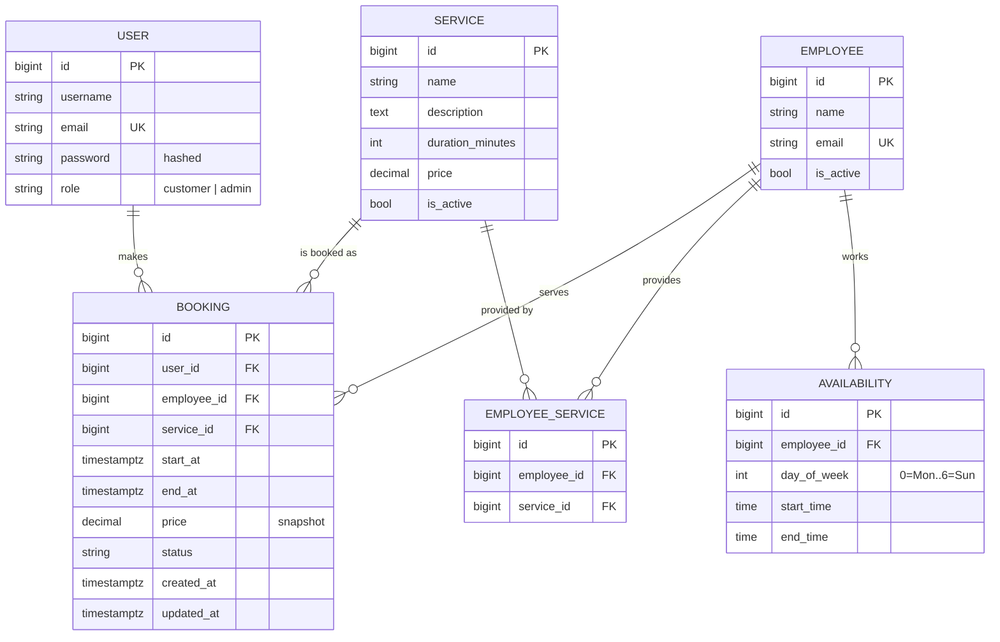

# Appointment Booking API

Booking system for a small service business (barbershop, clinic, salon...). Customers pick a service, see free time slots and book one. The business manages services, employees, working hours and bookings.

**Backend:** Django 5.2 · Django REST Framework · PostgreSQL · SimpleJWT · Celery + Redis · drf-spectacular (OpenAPI)
**Frontend:** React 19 · React Router · Vite (no UI library, plain CSS)
**Infra:** Docker Compose (local) · Render + Vercel (deployment)

**Live demo:** https://booking-system-ochre-delta.vercel.app · **API docs:** https://booking-api-bkoe.onrender.com/api/docs/ (the free backend sleeps when idle, so the first request can take about a minute)

---

## Quick start

### With Docker (recommended)

```bash
docker compose up --build
docker compose exec web python manage.py createsuperuser   # becomes a business admin
docker compose exec web python manage.py seed_demo         # optional: demo services, staff, hours
```

- **App (frontend): http://localhost:5173/**
- API: http://localhost:8000/api/v1/
- Swagger docs: http://localhost:8000/api/docs/
- Django admin: http://localhost:8000/admin/

Log in to the app with the superuser to see the **Admin** section: add services, employees and working hours (or load the demo set with `seed_demo`), then book as a customer.

### Without Docker

Requires Python 3.12+, PostgreSQL 14+ and Redis.

```bash
python -m venv .venv
.venv\Scripts\activate          # Windows  (Linux/macOS: source .venv/bin/activate)
pip install -r requirements.txt
cp .env.example .env            # then edit DB credentials
python manage.py migrate
python manage.py createsuperuser
python manage.py seed_demo      # optional: demo services, staff, hours
python manage.py runserver

# in other terminals (email notifications + expiring stale pending bookings)
celery -A core worker -l info --pool=solo      # --pool=solo is needed on Windows
celery -A core beat -l info
```

To try things without a Celery worker, set `CELERY_TASK_ALWAYS_EAGER=True` in `.env`.

Frontend (needs Node 20+):

```bash
cd frontend
npm install
npm run dev        # http://localhost:5173, forwards /api to http://localhost:8000
```

### Tests

```bash
python manage.py test --settings=core.settings.test
# or: docker compose exec web python manage.py test --settings=core.settings.test
```

Tests need PostgreSQL (the double-booking guard is a PostgreSQL constraint). They cover slot calculation, all booking validation rules, status transitions and permissions, the database constraint itself, and a **concurrency test where 5 threads book the same slot at the same moment and exactly one wins**.

---

## API overview

All endpoints are under `/api/v1/`. Full interactive docs at `/api/docs/`.

| Method | Endpoint | Who | Description |
|---|---|---|---|
| POST | `auth/register/` | anyone | Create a customer account |
| POST | `auth/login/` | anyone | Get JWT `access` + `refresh` tokens |
| POST | `auth/refresh/` | anyone | New access token |
| POST | `auth/logout/` | user | Blacklist refresh token |
| GET | `auth/me/` | user | Current user |
| GET | `services/` | anyone | Active services with their employees |
| POST/PATCH/DELETE | `services/…` | admin | Manage services (DELETE = deactivate) |
| GET | `employees/?service_id=` | anyone | Active employees (no email for customers) |
| POST/PATCH/DELETE | `employees/…` | admin | Manage employees, assign `service_ids` |
| GET | `availabilities/?employee=` | anyone | Weekly working hours |
| POST/PATCH/DELETE | `availabilities/…` | admin | Manage working hours |
| GET | `slots/?service_id=&date=&employee_id=` | anyone | **Free time slots** |
| POST | `bookings/` | user | Book a slot → `pending` |
| GET | `bookings/?status=&when=upcoming\|past` | user | **Booking history** (admin sees all) |
| GET | `bookings/{id}/` | owner/admin | Booking details |
| POST | `bookings/{id}/cancel/` | owner/admin | Cancel |
| POST | `bookings/{id}/confirm/` | admin | Confirm |
| POST | `bookings/{id}/complete/` | admin | Mark as completed |

Typical customer flow:

```http
GET  /api/v1/services/
GET  /api/v1/slots/?service_id=1&date=2026-10-05
POST /api/v1/bookings/   {"service_id": 1, "employee_id": 2, "start_at": "2026-10-05T10:00:00+05:00"}
GET  /api/v1/bookings/?when=upcoming
```

---

## Database design



Key decisions:

- **Employee ↔ Service is many-to-many.** Several barbers do haircuts, and one barber does several services. A booking still stores `employee_id` and `service_id`; the pair is validated against `EmployeeService`.
- **`Booking.price` and `Booking.end_at` are snapshots.** Changing a service's price or duration later doesn't rewrite existing bookings or the history.
- **Slots are computed, not stored.** A slots table would have to be regenerated whenever hours, durations or bookings change, and could drift out of sync. Instead: *availability of that weekday − active bookings − the past*, stepping every 15 min.
- **Availability is weekly and recurring**, with several rows per day allowed (split shifts / lunch breaks). Overlapping rows for the same employee and day are rejected.
- **Nothing that has bookings is ever hard-deleted.** Booking FKs use `PROTECT`; deleting a service or employee through the API deactivates it (`is_active=False`), so history stays intact.
- **Database constraints back up the application checks:** `price >= 0`, `duration > 0`, `start < end`, `end_at > start_at`, unique `(employee, service)`, unique email, and the no-overlap exclusion constraint below.
- **Indexes** match the hot queries: `(employee_id, start_at)` for slot lookup and `(user_id, start_at DESC)` for booking history.

---

## Preventing double booking (race conditions)

> *"What happens if two users book the same slot at the same time?"*

An application check like `if not Booking.objects.filter(overlapping).exists(): create()` is **not enough**: two requests can both run the check before either inserts, and both succeed.

The real guard is a PostgreSQL **exclusion constraint**:

```sql
EXCLUDE USING gist (employee_id WITH =, tstzrange(start_at, end_at, '[)') WITH &&)
WHERE (status IN ('pending', 'confirmed'))
```

- It rejects any two *active* bookings of the same employee whose time ranges overlap. It covers partial overlaps (10:00–10:30 vs 10:15–10:45), not only identical start times, which a simple `UNIQUE(employee, start_at)` would miss.
- `[)` ranges mean back-to-back bookings (10:00–10:30 and 10:30–11:00) are allowed.
- Cancelled and completed bookings don't block anything, so cancelling frees the slot automatically.
- When two inserts race, PostgreSQL makes the second one wait for the first transaction, then fails it with `exclusion_violation` (SQLSTATE `23P01`). The service layer catches exactly that error and returns **409 Conflict**: *"This time slot is no longer available."*
- The application-level overlap check is still done first, only to give a friendly error in the common, non-concurrent case.

Status changes use `SELECT … FOR UPDATE` on the booking row, so e.g. an admin confirming and a customer cancelling at the same moment can't both succeed.

---

## Architecture

```
HTTP ─► views (auth, permissions, HTTP in/out)
          │
          ├─► serializers   input format only (types, required fields) + output shape
          │
          ├─► selectors.py  read queries: available slots, booking history
          └─► services.py   business rules + writes: create_booking, change_status
                  │
                  ▼
             PostgreSQL     constraints are the final guarantee
                  │
          Celery (Redis) ─► emails after commit, expiring stale pending bookings
```

- Business logic lives in `apps/bookings/services.py` and `selectors.py`, following the [HackSoft Django Styleguide](https://github.com/HackSoftware/Django-Styleguide), not in views or serializers. The API views, the Django admin actions, Celery tasks and tests all call the same functions, so the rules can't be bypassed. For example, admin bulk actions go through `change_status`.
- **Apps:** `users` (custom user + role, JWT auth), `services` (services, employees, availability), `bookings` (bookings, slots, business logic).
- **Auth:** JWT (SimpleJWT) with 30-min access tokens and rotating, blacklisted refresh tokens. Role-based permissions: `customer` or `admin`. Registration always creates customers; admins are created with `createsuperuser` or in the Django admin.
- **Secure by default:** the default DRF permission is `IsAuthenticated`, and public endpoints (services, employees, slots) opt out explicitly. Anonymous and user requests are throttled.
- **Timezones:** all datetimes are stored in UTC (`timestamptz`). Availability hours are wall-clock times in the business timezone (`TIME_ZONE`, default `Asia/Tashkent`). Slots are built in that timezone and returned as ISO 8601 with offset, so a frontend in any timezone can display them correctly.
- **Emails** are sent by Celery via `transaction.on_commit`, so no email goes out for a booking that was rolled back. A failing mail queue never fails the booking itself.

---

## Frontend

A React single-page app in `frontend/` that uses only the public REST API, the same one documented in Swagger.

| Screen | What it does |
|---|---|
| Services | Service cards with duration, price and who provides them |
| Book | 3 steps: specialist (or "anyone available") → date strip (up to 60 days) → time slots grouped by morning/afternoon/evening, with a live summary |
| My bookings | Upcoming / past tabs, status badges, cancel with inline confirmation |
| Log in / Sign up | Field-level validation errors from the API; `?next=` returns you to the booking you started |
| Admin → Bookings | Counters (awaiting confirmation, upcoming, completed), filters, confirm / complete / cancel |
| Admin → Services, Employees | Create, edit, activate/deactivate; assign services to employees |
| Admin → Working hours | Weekly schedule per employee, split shifts, "Add Mon–Fri" shortcut |

Decisions worth knowing:

- **Proxy instead of CORS.** In development Vite forwards `/api` to Django; in production Vercel does the same with a rewrite (`frontend/vercel.json`). The browser always sees one origin. To call the API directly from another domain instead, set `VITE_API_URL` and `CORS_ALLOWED_ORIGINS`.
- **JWT handling.** Tokens live in `localStorage`. On a 401 the client refreshes once and retries. Parallel requests share one refresh call, because refresh tokens rotate and are blacklisted, so a second refresh with the old token would fail. If refresh fails, public pages keep working anonymously.
- **Times are always shown in the business timezone** (`VITE_BUSINESS_TZ`, same as Django's `TIME_ZONE`). A customer abroad sees the local time they must show up.
- **Race conditions in the UI.** If someone takes the slot between "select" and "confirm", the API returns 409. The page shows *"Sorry, someone just booked this time"* and reloads the free slots.
- **Business rules stay on the server.** The UI hides buttons that can't apply, such as Complete before the start time, but it never enforces rules on its own. The API decides.
- Responsive down to phone width, with light and dark themes following the OS setting.

---

## Business rules & edge cases

| Case | Behaviour |
|---|---|
| Two users book the same slot simultaneously | Exactly one succeeds, the other gets **409** (DB exclusion constraint) |
| Booking partially overlaps another (10:15 vs 10:00–10:30) | 409, also enforced by the constraint |
| Back-to-back bookings | Allowed |
| Same customer, overlapping bookings with two different employees | 400, a person can't be in two places |
| Employee doesn't provide the chosen service | 400 |
| Booking outside working hours, or ending after the shift ends | 400 |
| Booking spanning a lunch break (two availability windows) | 400, must fit inside one window |
| Start time not on the offered slot grid (e.g. 10:07) | 400, prevents unusable gaps |
| Booking in the past / more than 60 days ahead | 400 |
| Inactive service or employee | Not offered in slots, 400 on booking |
| Service price/duration changed after booking | Existing bookings keep their snapshot |
| Customer cancels less than 2 h before start | 400 (cancellation policy); admin can still cancel |
| Customer tries to confirm/complete | 403 |
| Customer accesses someone else's booking | 404 (doesn't reveal that it exists) |
| Invalid transition (cancelled → confirmed, completed → cancelled…) | 400. Allowed: pending→confirmed/cancelled, confirmed→completed/cancelled |
| Completing a booking that hasn't started | 400 |
| Admin and customer change the same booking simultaneously | Row lock (`select_for_update`), one wins, the other sees the new state |
| Pending booking never confirmed | Auto-cancelled by a Celery beat task once its start time passes |
| Cancelled booking | Slot becomes free again immediately |
| Deactivating an employee with upcoming bookings | 409, the admin must handle those bookings first |
| Deleting a service or employee with history | Soft delete (`is_active=False`); history is kept |
| Overlapping availability rows for one employee/day | 400 |
| Self-registration with `"role": "admin"` | Ignored, always a customer |
| Duplicate email (case-insensitive), weak password | 400 |
| Datetime sent without timezone offset | Read in the business timezone |

**Known limitations / next steps:** holidays and one-off time off (a `TimeOff` table), buffer time between appointments, per-employee timezones, a booking status history table for a full audit trail, and calendar (.ics) export.

---

## Deployment (Render + Vercel)

```
browser ──► Vercel (React build) ──/api/*──► Render web service (gunicorn + Django) ──► Render PostgreSQL
```

The frontend is static files on Vercel. Vercel forwards `/api/*` to the backend on Render, so there is no CORS and the JWT flow is the same as in development.

**1. Backend on Render.** Dashboard → **New → Blueprint** → pick this repo. `render.yaml` creates:

- `booking-db`: PostgreSQL. The first migration enables `btree_gist` for the double-booking constraint.
- `booking-api`: the web service. The build installs requirements and runs `collectstatic` (WhiteNoise serves the admin and API-docs assets). Start runs `migrate`, then `ensure_superuser` (creates the admin from `DJANGO_SUPERUSER_*` once, never promotes an existing account, and logs the reason if it can't create it), then gunicorn.

When asked, fill in `DJANGO_SUPERUSER_USERNAME`, `DJANGO_SUPERUSER_EMAIL` and `DJANGO_SUPERUSER_PASSWORD`. `SECRET_KEY` is generated, and `DATABASE_URL` is wired in from the database. Production settings (`core/settings/prod.py`) refuse to start without a `SECRET_KEY`. They add Render's hostname to `ALLOWED_HOSTS`, redirect to HTTPS and log errors to stdout.

Check: `https://booking-api-bkoe.onrender.com/api/docs/` and `/admin/`.

**2. Frontend on Vercel.** **Add New → Project** → this repo, **Root Directory `frontend`** (Vite is detected). Environment variables:

| Variable | Value |
|---|---|
| `VITE_BACKEND_URL` | `https://booking-api-bkoe.onrender.com` (the "Django admin" link) |
| `VITE_BUSINESS_TZ` | `Asia/Tashkent` (must match Django's `TIME_ZONE`) |

If Render gave the service a different URL (the name `booking-api` may already be taken, as it was here), update the destination in `frontend/vercel.json` and `VITE_BACKEND_URL`.

**Free-plan trade-offs:**

- Celery runs tasks inline (`CELERY_TASK_ALWAYS_EAGER=True`), so no Redis or worker is needed. Emails go to the service logs (console backend), and a failed email still never fails a booking.
- Without a beat process, unconfirmed pending bookings are not auto-cancelled after their start time. Past slots are never offered, so this doesn't affect double booking. `render.yaml` has a commented paid worker + Redis setup that runs worker and beat.
- A free web service sleeps after 15 minutes idle, so the first request takes about a minute. The free database expires after 30 days.

---

## Configuration

Booking rules live in `core/settings/base.py`:

```python
BOOKING_SLOT_STEP_MINUTES = 15          # slot grid
BOOKING_HORIZON_DAYS = 60               # how far ahead customers can book
BOOKING_CANCELLATION_DEADLINE_HOURS = 2 # cancellation policy for customers
```

Environment variables: see `.env.example`.

---

## Use of AI tools


AI (Claude) was used as a pair programmer:

- **Design review:** I drew the ER diagram myself, and AI review pointed out the missing Employee↔Service many-to-many relation, the need for a DB-level double-booking guard, and timezone handling. I changed the design accordingly.
- **Code generation:**  the service/selector layer, tests, the React frontend and Docker setup were generated with AI from my design, then reviewed and adjusted.
- **How I verified it:** I read and understood every file, ran the test suite (including the concurrency test) against PostgreSQL, and went through the main flows in the browser and in Swagger.
